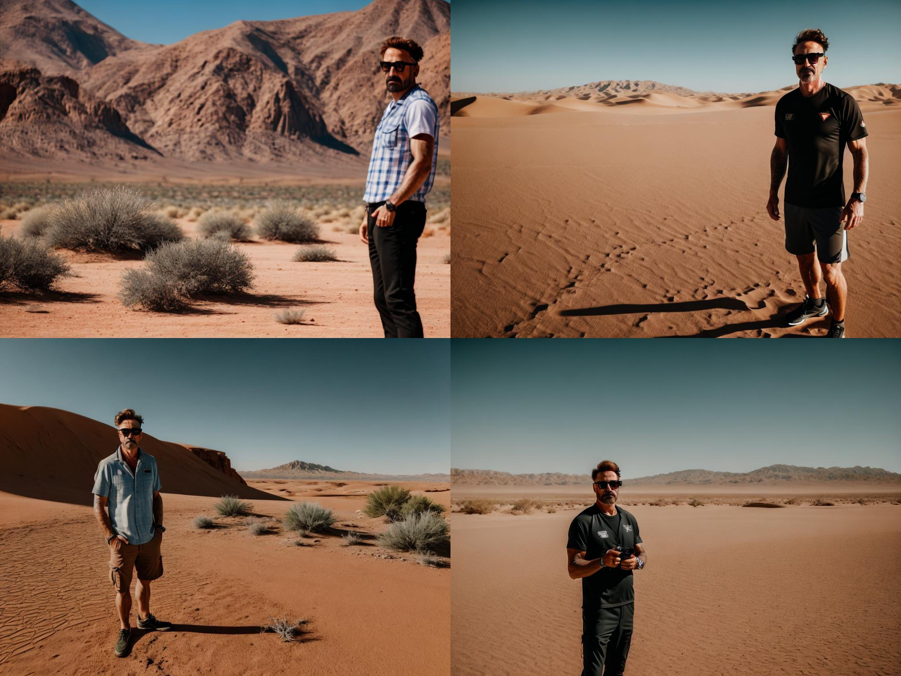

# ДЗ 4. Обучение Stable diffusion 1.5 методом Dreambooth

В этой ветке содержится решение 4-ей домашней работы по курсу "Глубокие генеративные модели". 
Код решения и использованные библиотеки приведены для обучения всей модели и LoRA в `DreamBooth_Stable_Diffusion.ipynb`
Код для инференса с controlnet всей модели и LoRA в `Controlnet_lora_full_model.ipynb`

Author: Фёдорова Инесса Алексеевна

В ходе работы были реализованы пункты, приведенные ниже

### 1. Собран датасет от 15 изображений одного персонажа 

### 2. Кропнуты и заресайзены лица, с помощью https://www.birme.net/

### 3. Скачан предобученный чекпоинт SD1.5 с [civitai.com](https://civitai.com/)

### 4. Обучен Stable diffusion 1.5.

##### Параметры
**--instance_prompt="a photo of sks man face"** токен на который мы хотим обучить персонажа 

**--class_prompt="a photo of man face"** промт для регуляризации

### Примеры генераций в 768х1024

### 5. Обучить LoRA модель

На основе базовой модели SD1.5 была обучена LoRA. Были проведены эксперименты с rank 2, 4 и 8. Лучшие результаты показала LoRA с rank=8, результаты по каждой из моделей приведены ниже. С увеличением rank растет качество модели.

#### Тест lora rank=2

#### Тест lora rank=4

#### Тест lora rank=8

#### Результаты лучшего чекпоинта с rank=8

### 6. Сравнить лучший чекпоинт Unet и Lora
Лучшей из двух моделей является обученный Unet, так как генерации с одинаковыми промптами и параметрами выглядят более естественно и детализованно (качество дообучения всей модели обычно лучше качества низкоранговых адаптаций). Это же видно и на результатах инференса с ControlNet.

### 7. ControlNet

#### Генерация Unet+Controlnet (портреты)

#### Генерация Unet+Controlnet (позы)

#### Генерация LoRA+Controlnet (портреты)

#### Генерация LoRA+Controlnet (позы)

